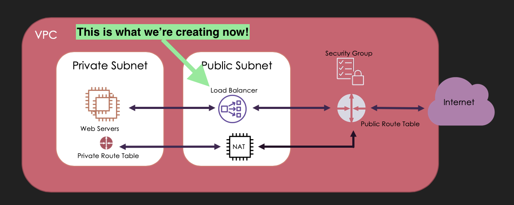
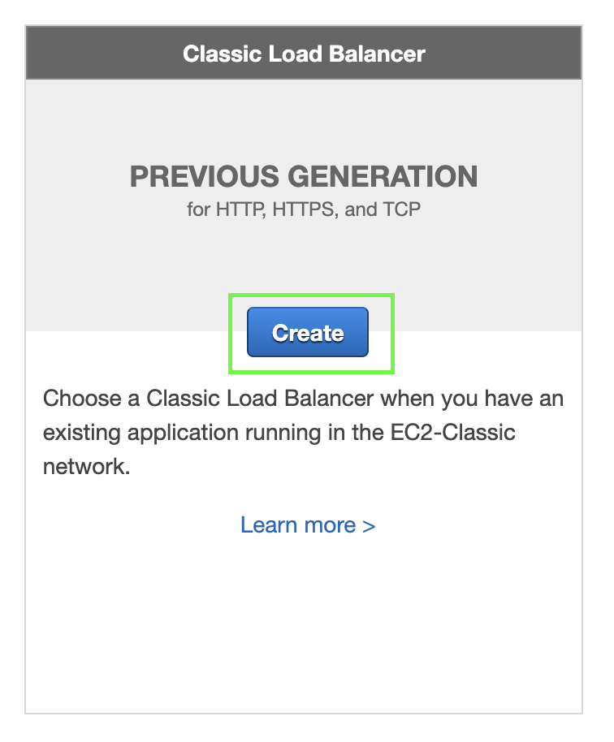
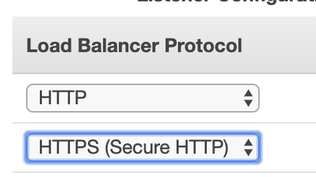
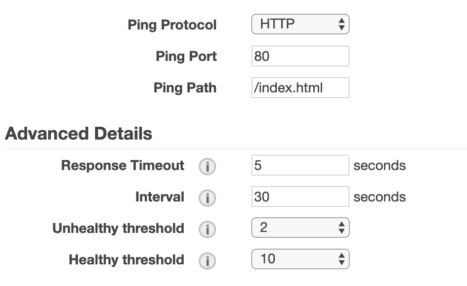

# Load Balancer 
A managed AWS service that distributes traffic to targets you specify

There are 3 types:
- ALB - HTTP/S (layer 6)
- NLB - TCP, UDP (layer 4)
- ELB - Basic load balancing for EC2 👈🏿 This is what we're going to work with!

### Security Group for Load Balancer
The load balancer will need to accept incoming HTTP traffic so that it can forward requests onto your private web servers. 

Security Group for a __Public__ load balancer
1. From the console go to Services > Networking and Content Delivery > VPC > Security Groups (or from the left, go to Security Groups) > Create Create Security Group
2. Fill in the fields > Create:

  - Security group name: __http_elb_securitygroup__
  - Description: __Allows my incoming HTTP requests from the internet__
  - VPC: __cloud-networking-bootcamp__

3. Create some rules for your new sg for *Inbound*:
  - Protcol: HTTP
  - Custom: 0.0.0.0/0 (traffic from anywhere)

### Creating an ELB

1. Services > EC2 > Load Balancers

2. Create Load Balancers

3. Classic Load Balancer > Create

3.1 Load Balancer Name: __cloud-networking-bootcamp-ELB__
3.2 Create LB Inside: __[your VPC you’ve created]__

4. Listener Configuration

4.1 Add > HTTPS

4.2 Select Subnets

Available Subnets > + [your public subnet]

__NOTE: Notice what the console suggests that you have at least 2 instances in 2 AZ’s? We’re going to create these and your load balancer will go between these 2.__

5. Click ‘Next: Assign Security Groups’

6. Choose your __http_elb_securitygroup__ security group

7. Click ‘Next: Configure Security Settings’

__NOTE: It’s going to ask you to create a server certificate, but we're not doing this today as we don't have a domain. So, we’re not going to use HTTPS. For any public traffic, your app will want to use HTTPS.__

#### Go back to Listener Configuration and REMOVE HTTPS

Now you won’t be asked to allocated a certificate, but it will give you a stern warning ❗️

8. Click ‘Next: Configure Health Check’

Leave the defaults as is!

__This is the fault tolerance of your load balancer and EC2. If your EC2 is not available to serve traffic within these thresholds, then it would be considered ‘unhealthy’. You can use this threshold for scaling events.__

9. Click ‘Next: Add EC2 Instances’

Choose your instances (minimum 2 instances)

10. Click 'Next: Add Tags' > nothing to do here > Click 'Review and Create'

11. Create

🌈 Woo hoo! You have created your ELB! 🌈

