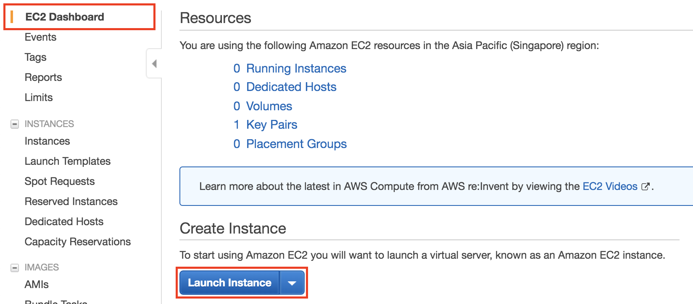
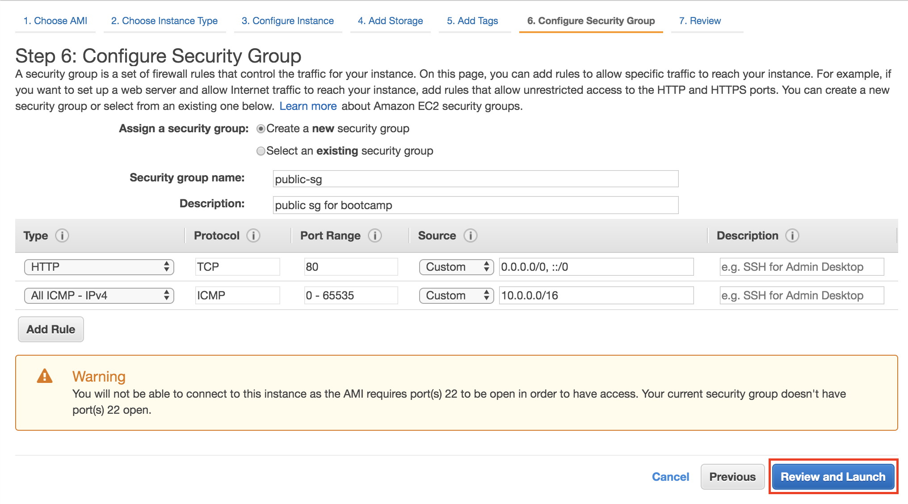
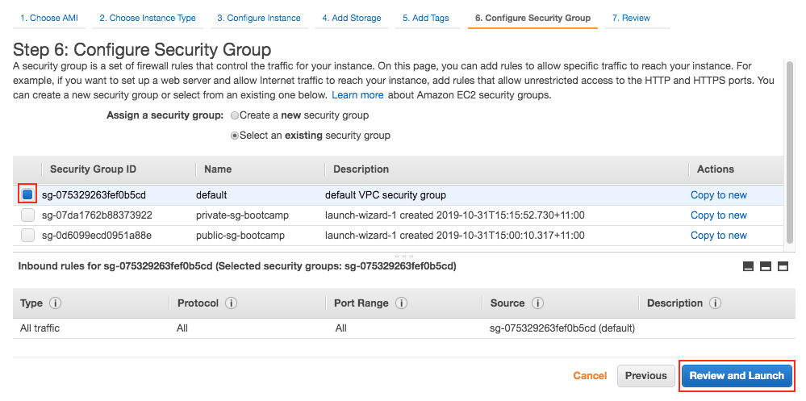

# Testing Your Network

By the end of this session you'll have:
  1. An EC2 in your public subnet
  2. An EC2 in your private subnet
  3. A way to remotely access your public EC2 instance using SSM
  4. A way to removely access your private EC2 instance via your public EC2 instance

###🚀 Launch an EC2 instance into your public subnet
We're going to deploy an EC2 instance into our public subnet create in the previous session. This EC2 will have access to the internet and will also be able to accept incoming connections from the internet.

Follow these steps to create the EC2 to be deployed in the __public__ subnet:

1. From the Console, go to Services > Compute > EC2 > Launch Instance
   
   note: ensure your region is still set to Sydney
2. Choose *Amazon Linux 2 AMI* > t2.micro
   
3. Click *Next: Configure Instance Details*
   
4. Select the cloud-networking-bootcamp VPC and the associated public subnet
   
   
5. Ensure that "Auto-assign Public IP" is set to "Enable"
6. Assign the IAM role created earlier with SSM permissions
   
7. Next until you get to *Configure Security Group* > Create new Security Group
8. Security Group name: __public-sg__
9.  Add rule > Type: HTTP (port 80)
10. Review and Launch 
    
11. Launch the instance
    
12. When the popup appears, select "proceed without a key pair", then click "Launce Instances"
    

###🚀 Launch an EC2 instance into your private subnet
Follow these steps to create the EC2 to be deployed in the __private__ subnet, note there are some differences!

1. Follow steps 1-3 above for deploying an EC2 into your public subnet
4. Select the cloud-networking-bootcamp VPC and the associated private subnet
  
5. Next until you get to *Configure Security Group* > Choose an exisiting Security Group
6. Select the *Default* security group
  
7. Review and Launch > Launch
8. Create a *new* Key pair > Key pair name: __cloud-networking-bootcamp__
  

Note: You can name your instances as *public* and *private* to make the next steps easier 🤔